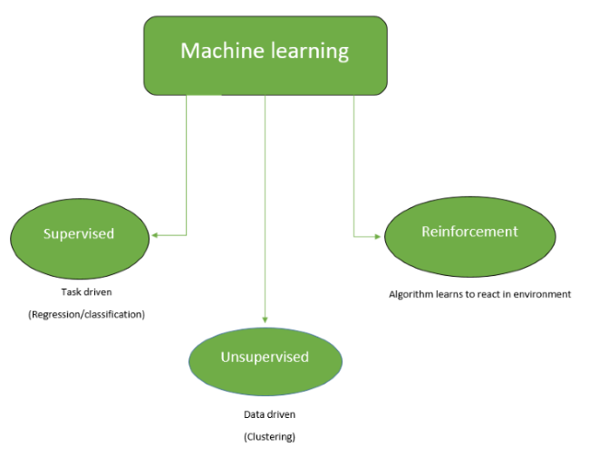

# Introduction To Machine Learning

Machine learning (ML) is the science of making computers learn and act like humans by feeding data and information without being explicitly programmed.Data is given to system,system analyse it & learn it.Machine acturately makes prediction & decision based on past data.

## Key Points :-
1. Data is in the form of Information.
2. Problem solving tool.
3. Combination of CS(Computer Science),Engineering & Statistics.
4. Interprets data & act on it.
5. Optimize performance criteria using past experience.

## Types Of Machine Learning :-
Now, let's have a look on different types of ML through below tree diagram
 

 
## What is Supervised Learning:-
